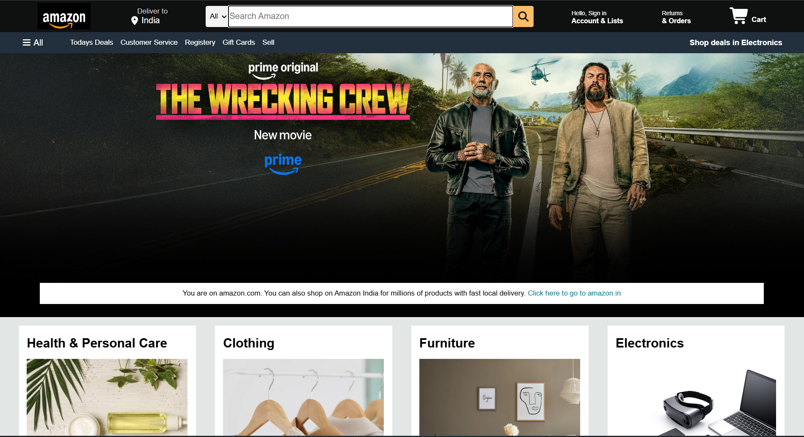
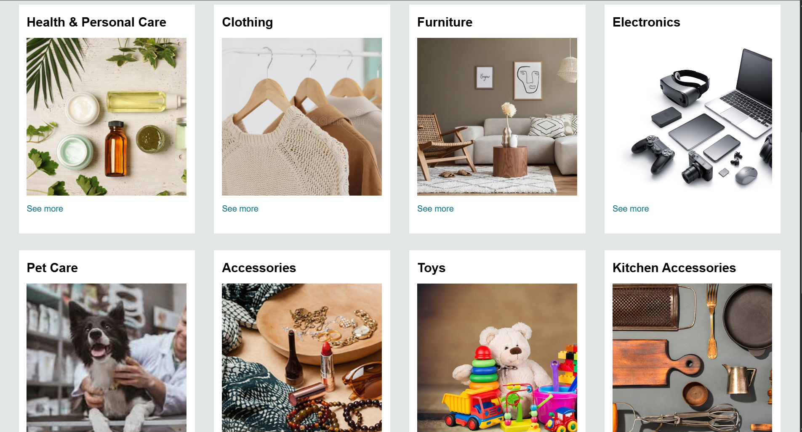
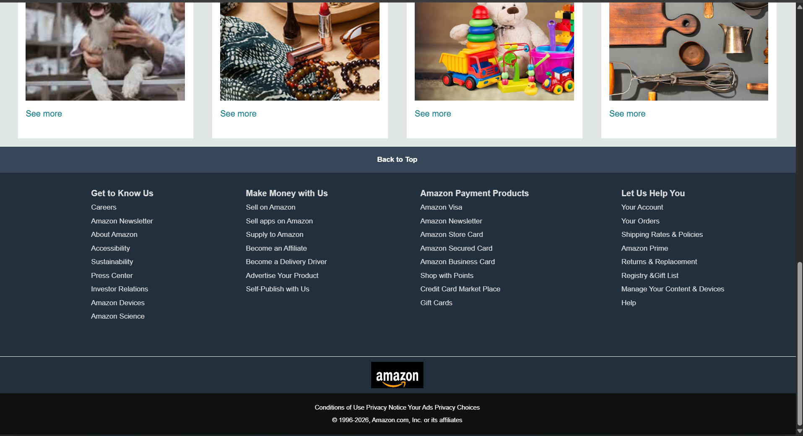

# Amazon UI Clone 🛒

A clean, responsive front-end replica of the Amazon homepage built using pure HTML5 and CSS3. 

### 📸 Project Screenshots

<table>
  <tr>
    <td align="center">
      <b>Header & Hero Banner</b><br>
      
    </td>
    <td align="center">
      <b>Product Categories Grid</b><br>
      
    </td>
    <td align="center">
      <b>Footer & Quick Links</b><br>
      
    </td>
  </tr>
</table>

## 🌟 Features
* **Navigation Bar:** Replicated top navigation including logo, location selector, search bar, account controls, and cart.
* **Sub-navbar:** Categories quick-links bar with hover states.
* **Hero Section:** Large featured movie banner with Prime Original branding.
* **Category Grid:** Clean card layout displaying product categories (Health & Personal Care, Clothing, Furniture, Electronics).

## 🛠️ Tech Stack
* **HTML5** – Page structure and semantic elements.
* **CSS3** – Custom styling, Flexbox layout, and position properties.

## 🚀 How to Run Locally

1. Clone the repository:
   ```bash
   git clone [https://github.com/your-username/amazon-clone.git](https://github.com/your-username/amazon-clone.git)
